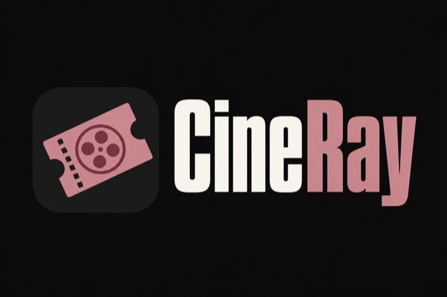
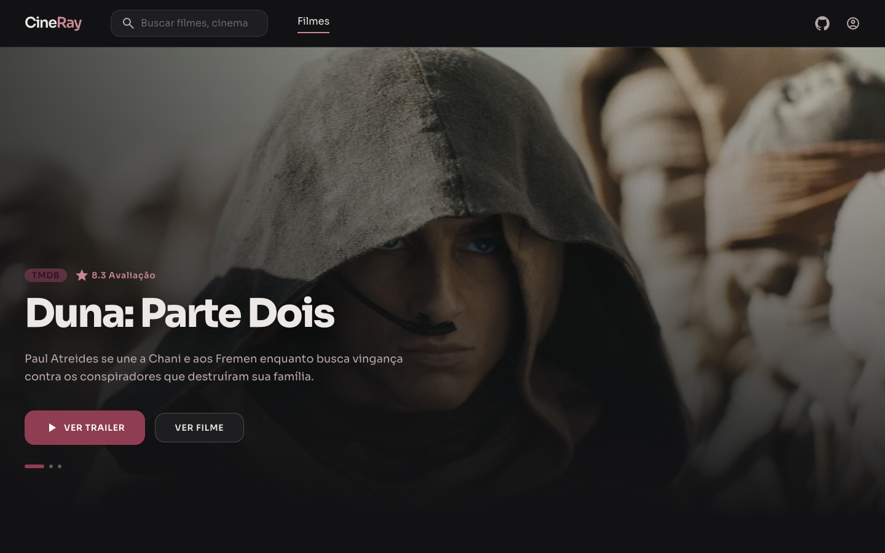
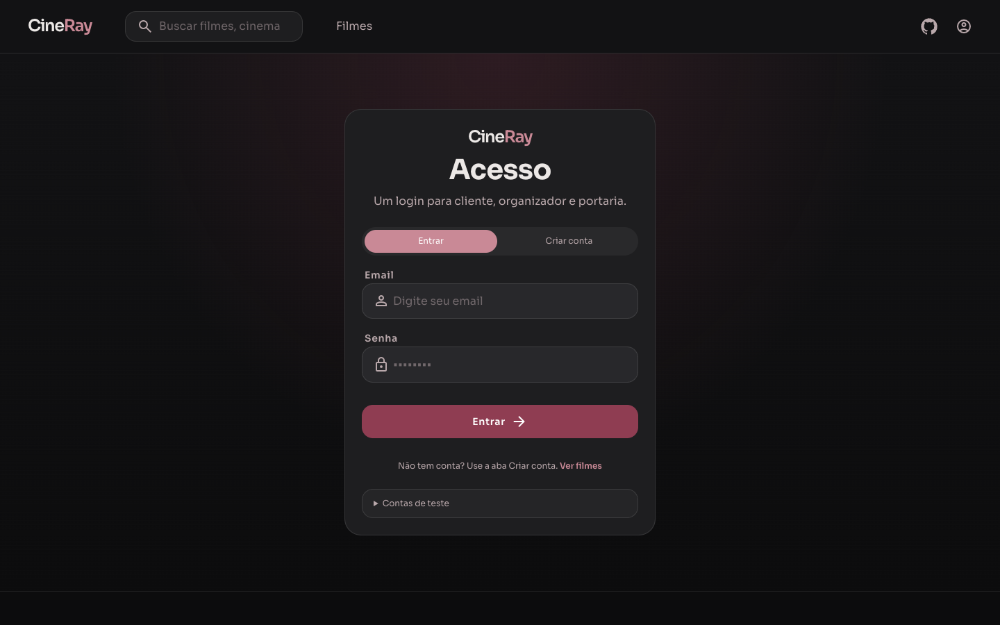
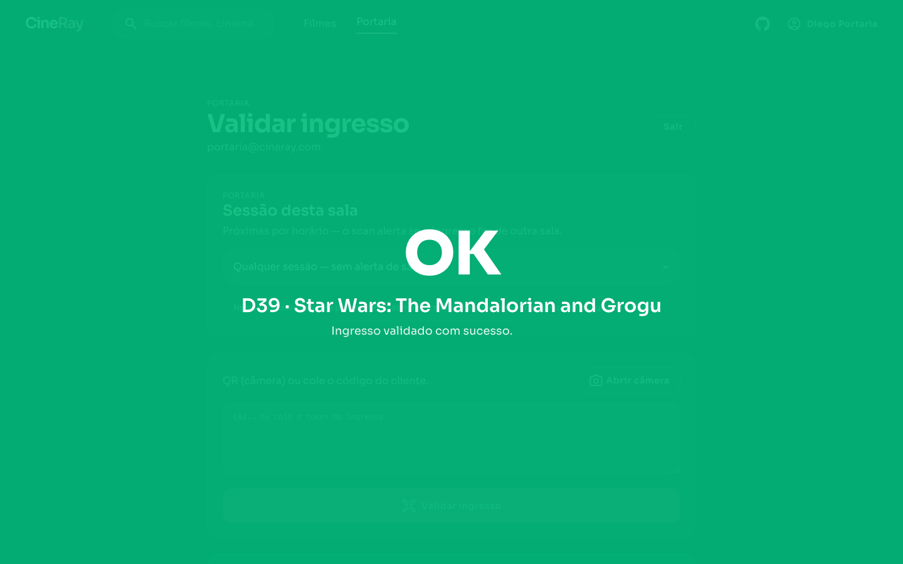

<a id="readme-top"></a>

<!-- PROJECT LOGO -->
<br />
<div align="center">
  <a href="https://github.com/szrayane/ticket_challenge">
    
  </a>

  <h3 align="center">Desafio Elite Dev 2026</h3>

> [!IMPORTANT]
> Se a API estiver em hospedagem gratuita (ex.: Render), o primeiro acesso pode demorar alguns segundos (“cold start”). Se a página não carregar, aguarde e atualize.

  <p align="center">
    Plataforma de ingressos de cinema: organizador publica evento → cliente escolhe assento → pagamento simulado → QR → portaria valida.
    <br />
    <a href="./DEPLOY.md">Guia de Deploy</a>
    ·
    <a href="./AI.md">Uso de IA</a>
    ·
    <a href="https://github.com/szrayane/ticket_challenge/issues">Reportar Erro</a>
  </p>
</div>

<!-- TABLE OF CONTENTS -->
<details>
  <summary>Sumário</summary>
  <ol>
    <li>
      <a href="#sobre-o-projeto">Sobre o Projeto</a>
      <ul>
        <li><a href="#hospedagem">Hospedagem</a></li>
        <li><a href="#funcionalidades">Funcionalidades</a></li>
        <li><a href="#feito-com">Tecnologias Utilizadas</a></li>
      </ul>
    </li>
    <li>
      <a href="#começando">Começando</a>
      <ul>
        <li><a href="#pré-requisitos">Pré-requisitos</a></li>
        <li><a href="#instalação">Instalação</a></li>
        <li><a href="#contas-de-teste">Contas de teste</a></li>
      </ul>
    </li>
    <li><a href="#tutorial-do-sistema">Tutorial do Sistema</a></li>
    <li><a href="#design--prototipagem">Design / Prototipagem</a></li>
    <li><a href="#decisões-técnicas">Decisões Técnicas</a></li>
    <li><a href="#a-fazer">A Fazer / Limitações</a></li>
    <li><a href="#licença">Licença</a></li>
    <li><a href="#contato">Contato</a></li>
  </ol>
</details>

<!-- ABOUT THE PROJECT -->

## Sobre o Projeto

<div id="sobre-o-projeto"></div>

<p align="center">
  
</p>

O **CineRay** é a solução para o **Desafio Elite Dev 2026**: uma plataforma de venda e validação de ingressos de cinema, com frontend, backend e MySQL.

O fluxo principal é:

1. O **organizador** busca o filme (TMDb) e cria a sessão (data, local, capacidade, preço)
2. O **cliente** escolhe o assento (hold de 10 min), paga (simulado) e recebe um QR cifrado
3. A **portaria** valida o ingresso por câmera ou código, na sessão correta

Optei por **mapa de assentos** (não pista) porque faz mais sentido para cinema e exige concorrência real por lugar. O backend é separado do front para deixar explícita a API, a concorrência no MySQL e o check-in.

### Hospedagem

<div id="hospedagem"></div>

<!-- Cole print com as URLs / domínios quando tiver deploy -->
<!--  -->

```text
[PRINT: cards com URL do front e da API — docs/screenshots/domains.png]
```

| Camada | Onde | URL |
|--------|------|-----|
| Frontend | [Vercel](https://vercel.com) | _cole a URL do front_ |
| API | [Render](https://render.com) | _cole a URL da API_ |
| Banco | MySQL (Render / gerenciado) | — |

> [!IMPORTANT]
> Em plano gratuito, a API no Render pode “acordar” lentamente. Se falhar no primeiro request, espere ~30s e tente de novo.

Passo a passo de deploy: [`DEPLOY.md`](./DEPLOY.md).

<div id="funcionalidades"></div>

### Funcionalidades

**Fluxo do desafio**

- Catálogo / eventos com integração **TMDb**
- Mapa de assentos com **hold de 10 minutos**
- Checkout com pagamento **simulado**
- Ingresso com **QR AES-256-GCM** (`CR2.…`)
- Compartilhamento por link `/i/:shareToken`
- **Portaria**: validação por câmera ou digitação (bloqueia inválido, adulterado, já usado e sessão errada)
- Papéis: cliente, organizador e portaria (staff via convite)

**Extras**

- Transferência / reivindicação de ingresso
- Google Wallet (Android, opcional)
- Envio do link do ingresso para iPhone
- Assentos ao vivo (mapa atualiza enquanto outras pessoas compram)
- Docker Compose (MySQL + API + front)
- Testes unitários e de fluxo no backend

<div id="feito-com"></div>

### Feito com

**Frontend**

- 
- 
- 
- 

**Backend**

- 
- 
- 
- 

**Extras**

- TMDb API · QR AES-256-GCM · Google Wallet (opcional) · nginx (Docker)

**Banco de dados**

MySQL 8, com `SELECT … FOR UPDATE` no hold/checkout e índice único em `active_slot` para impedir venda duplicada do mesmo assento.

<p align="right">(<a href="#readme-top">voltar ao topo</a>)</p>

<!-- GETTING STARTED -->

## Começando

<div id="começando"></div>

Você pode rodar tudo localmente (recomendado para avaliar) ou acessar o deploy quando as URLs acima estiverem preenchidas.

### Pré-requisitos

<div id="pré-requisitos"></div>

- Node.js **22+**
- MySQL **8** (ou Docker)
- Chave TMDb (gratuita) — obrigatória só para publicar títulos novos; o seed roda sem ela

```sh
node -v
npm -v
```

Chave TMDb: [developer.themoviedb.org](https://developer.themoviedb.org/reference/intro/getting-started)

### Instalação

<div id="instalação"></div>

1. Clone o repositório:

```sh
git clone https://github.com/szrayane/ticket_challenge.git
cd ticket_challenge
```

#### Opção A — Docker (tudo junto)

```bash
export TMDB_API_KEY=sua_chave
docker compose up --build
```

- Front: http://localhost:8080  
- API: http://localhost:3333  
- MySQL: localhost:3306 (user/senha `cineray`)

#### Opção B — Local (front + API + MySQL)

**1) MySQL**

```bash
docker compose up -d mysql
```

**2) Backend**

```bash
cd backend
npm install
cp .env.example .env
# edite TMDB_API_KEY e TICKET_QR_SECRET se quiser
npm run dev
```

API: http://localhost:3333

**3) Frontend** (na raiz do repo)

```bash
npm install
cp .env.example .env
npm run dev
```

App: http://localhost:5173

#### Variáveis principais

Backend (`backend/.env`):

```env
PORT=3333
NODE_ENV=development
STAFF_INVITE_CODE=cineray-staff
TICKET_QR_SECRET=sua_chave_secreta
TMDB_API_KEY=sua_chave_tmdb
MYSQL_HOST=127.0.0.1
MYSQL_PORT=3306
MYSQL_USER=cineray
MYSQL_PASSWORD=cineray
MYSQL_DATABASE=cineray
```

Front (`.env` na raiz):

```env
VITE_APP_API_URL=http://localhost:3333/api
VITE_CINEMA_API_URL=https://mock-api.driven.com.br/api/v8/cineflex
```

Não versionar `.env` com secrets reais. Google Wallet (opcional): ver `.env.example` do backend e [`DEPLOY.md`](./DEPLOY.md).

#### Testes

```bash
cd backend
npm run test:unit   # unitários (sem DB)
npm test            # unitários + QR + fluxo de ingressos
```

### Contas de teste

<div id="contas-de-teste"></div>

| Perfil | E-mail | Senha |
|--------|--------|-------|
| Organizador | `organizador@cineray.com` | `org1234` |
| Cliente 1 | `cliente1@cineray.com` | `cli1234` |
| Cliente 2 | `cliente2@cineray.com` | `cli1234` |
| Portaria | `portaria@cineray.com` | `porta1234` |

Evento seed: **Duna: Parte Dois**.

Staff novo: `/login` → **Criar conta** → **Sou da equipe** → código `cineray-staff`.

Pagamento demo: `4111 1111 1111 1111` (ok) / `4000 0000 0000 0002` (recusa).

<p align="right">(<a href="#readme-top">voltar ao topo</a>)</p>

<!-- TUTORIAL -->

## Tutorial do Sistema

<div id="tutorial-do-sistema"></div>

### Vídeo

<div align="center">

<!--
  Depois de gravar:
  1) Abra uma issue no GitHub
  2) Arraste o .mp4 no comentário
  3) Copie o link user-attachments e cole SOZINHO numa linha abaixo (sem markdown)
-->

```text
┌──────────────────────────────────────────────────────────────┐
│                                                              │
│              🎬  ESPAÇO PARA O VÍDEO DE DEMO                 │
│                                                              │
│   Cole aqui o link do GitHub (user-attachments) do .mp4     │
│   Ex.: https://github.com/user-attachments/assets/xxxx      │
│                                                              │
└──────────────────────────────────────────────────────────────┘
```

</div>

> Dica: no GitHub, arraste o `.mp4` em um comentário de issue; o link `user-attachments` embute o player no README.

### Design / Prototipagem

<div id="design--prototipagem"></div>

Link para o design:

- [Design / Prototipagem no Figma](https://www.figma.com/design/3Q8k3j0O6EzRdbkk539TpW/CineRay?node-id=0-1&t=nl4ZuD7wMNB9QiCm-1)

### Telas do sistema

Prints em `docs/screenshots/` — salve com estes nomes (a seção já aponta para eles):

| Arquivo | Tela |
|---------|------|
| `01-home.png` | Tela inicial / catálogo |
| `02-login.png` | Login |
| `04-validar-ingresso.png` | Validar ingresso |

#### Tela inicial

<p align="center">
  
</p>

#### Login

<p align="center">
  
</p>

#### Validar ingresso

<p align="center">
  
</p>

### Fluxo rápido para avaliar

1. Login como organizador (ou use o seed)
2. Publique um filme via TMDb (opcional)
3. Login como cliente → escolha assento → pague
4. Meus ingressos → QR ou copiar link `/i/...`
5. Login portaria → valide pela câmera ou código

<p align="right">(<a href="#readme-top">voltar ao topo</a>)</p>

## Decisões Técnicas

<div id="decisões-técnicas"></div>

- **Mapa de assentos** — concorrência real por lugar (não pista)
- **Hold 10 min + `SELECT … FOR UPDATE`** — trava na seleção; MySQL serializa a compra
- **QR AES-256-GCM** — payload `CR2.…` ilegível sem `TICKET_QR_SECRET`
- **Assentos ao vivo** — mapa atualiza enquanto outras pessoas compram
- **Staff com convite** — organizador/portaria só via `STAFF_INVITE_CODE`
- **Uso de IA** — Cursor para acelerar implementação; decisões e validação foram minhas → [`AI.md`](./AI.md)

### Estrutura

```text
ticket_challenge/
├── backend/          # API Express + MySQL + testes
├── src/              # React (Vite)
├── public/
├── docs/             # screenshots / materiais do README
├── docker-compose.yml
├── DEPLOY.md
├── AI.md
└── README.md
```

<p align="right">(<a href="#readme-top">voltar ao topo</a>)</p>

## A Fazer / Limitações

<div id="a-fazer"></div>

- [x] Fluxo cliente (assentos, hold, checkout, QR)
- [x] Organizador + TMDb
- [x] Portaria (câmera / código)
- [x] MySQL + concorrência (`FOR UPDATE`)
- [x] Deploy documentado (Vercel + Render)
- [ ] Vídeo de demonstração no README
- [x] Screenshots (home, login, validar)
- [ ] Preencher URLs de produção na seção Hospedagem

**Fora de escopo / limitações**

- Pagamento fictício
- Sem `TMDB_API_KEY`, o seed roda; publicar pela busca TMDb precisa da chave
- Apple Wallet oficial exige conta Apple Developer paga — no CineRay o iPhone recebe o link `/i/...`
- Sem `GOOGLE_WALLET_*`, o botão Android fica desabilitado; “Enviar para iPhone” funciona na mesma

<p align="right">(<a href="#readme-top">voltar ao topo</a>)</p>

## Licença

<div id="licença"></div>

Projeto desenvolvido para o Desafio Elite Dev 2026. Consulte o repositório para termos de uso do desafio.

<p align="right">(<a href="#readme-top">voltar ao topo</a>)</p>

## Contato

<div id="contato"></div>

**Rayane Souza** — [GitHub](https://github.com/szrayane)

Link do projeto: [https://github.com/szrayane/ticket_challenge](https://github.com/szrayane/ticket_challenge)

<p align="right">(<a href="#readme-top">voltar ao topo</a>)</p>
